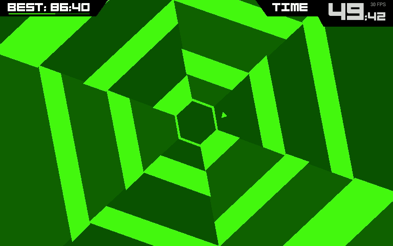
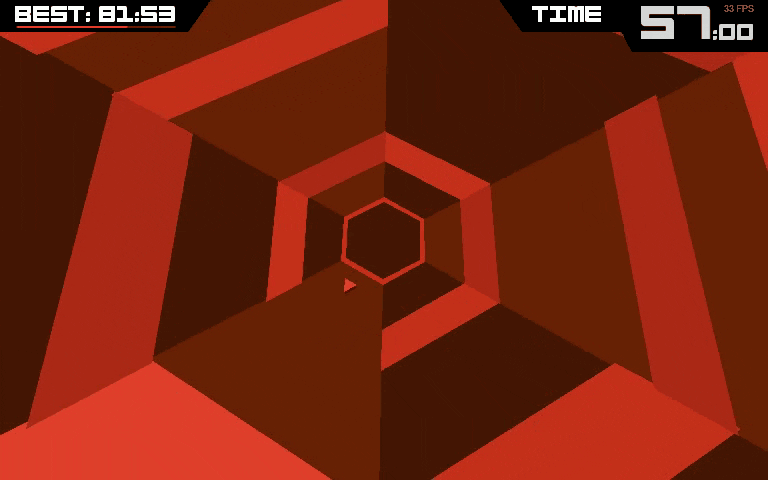

# Super Hexagon 

 - Based on reinforcement learning 
 - Beats all six levels easily end to end (i. e. from pixel input to action output)
   - A level counts as beaten if one survives at least 60 seconds
 

## Example

<div align="center">


### About The Game
 - Super Hexagon is a fast-paced twitch game in which the player controls a triangle on a hexagonal grid in the center while walls come from the edges of the screen. The controls are simple: the player must pivot their triangle left or right into an opening in order to survive.
<div align="center">


<div align="center">

&nbsp;

</div>


### Training
 - The reinforcement learning agent receives a reward of -1 if it dies otherwise a reward of 0
 - The network has two convolutional streams
   - For the first stream the frame is cropped to a square and resized to 60 by 60 pixel
   - Since the small triangle which is controlled by the player is barely visible for the first stream,
     a zoomed-in input is given to the second stream
   - For the fully connected part of the network the feature maps of both streams are flattened and concatenated
   - See `utils.Network` for more implementational details
 - Additionally, a threshold function is applied to the frame
     such that the walls and the player belong to the foreground and everything else belongs to the background
   - See `superhexagon.SuperHexagonInterface._preprocess_frame` for more implementational details
 - The used hyperparameters can be found at the bottom of `trainer.py` below `if __name__ == '__main__':`
 
 
### Rainbow
 - All six Rainbow [3] extensions have been evaluated
 - Double Q-Learning [4] and Dueling Networks [5] did not improve the performance
 - n-step significantly decreased the performance
 - Prioritized experience replay [6] at first performs better, 
   however, after roughly 300,000 training steps the agent trained without prioritized experience replay performs better
 - The distributional approach [1] significantly increases the performance of the agent
   - Distributional RL with quantile regression [7] gives similar results
 - Noisy networks [2] facilitate the exploration process
   - However, the noise is turned off after 500,000 training iterations

### PyRLHook
In order to efficiently train the agent, a C++ library was written. This library serves two functions:
Firstly, it efficiently retrieves the frames and sends them to the python process. 
Secondly, it intercepts the system calls used to get the system time such that the game can be run at a desired speed.

To do so, the library injects a DLL into the game's process.
This DLL hooks into the OpenGL function `wglSwapBuffers` as well as the system calls `timeGetTime`, `GetTickCount`, `GetTickCount64`, and `RtlQueryPerformanceCounter`.

The function `wglSwapBuffers` is called every time the game finishes rendering a frame in order to swap the back and front buffer. 
The `wglSwapBuffers` hook first locks the games execution. 
If one wants to advance the game for one step and retrieve the next frame `GameInterface.step` can be called from python.
The this releases the lock until `wglSwapBuffers` is called again. 
Then the back buffer is copied into a shared memory space in order to be returned by `GameInterface.step`.

The time perceived by the game can be adjusted with the methods `GameInterface.set_speed(double factor)` and `GameInterface.run_afap(double fps)`. 
`set_speed` adjusts the perceived time by the given factor. I. e. if the factor is `0.5` the game runs at half the speed. 
`run_afap` makes the game think it runs with the specified FPS i. e. the current time is incremented by `1/fps` every time `GameInterface.step` is called.

For more implementational details see `RLHookLib/PyRLHook/GameInterface.cpp` (especially the constructor and the method `step`) 
as well as `RLHookLib/RLHookDLL/GameInterfaceDll.cpp` (especially the methods `onAttach`, `initFromRenderThread`, and `hWglSwapBuffers`).

In theory, this library should also work for other games written with OpenGL.

## Usage

The following python libraries are required:

```
numpy
pytorch
opencv-python
```

Note that both the python process as well as the game process need to be run with admin privileges.
In order to always run the game with admin privileges right click on the Super Hexagon executable `superhexagon.exe`, 
select `Properties` and within the `Compatability` tab check `Run this program as an administrator`.

The game should be in windowed mode and VSync should be disabled.

Additionally, you need to compile the C++ library. 
Make sure you have a Visual Studio compiler (MSVC C++ x64/x86 build tools) installed, 
including CMake (C++ CMake tools for Windows) and a Windows 10 SDK. 
Also make sure that CMake can be called from the commandline.

Clone the repository.
```
git clone https://github.com/polarbart/SuperHexagonAI.git
cd SuperHexagonAI
```

Compile the DLL as well as a helper executable.
```
cd RLHookLib
python compile_additional_binaries.py
```

Then you can install the library globally using pip.

```
pip install .
```

### Evaluation
In order to run the AI, first download the pretrained network [super_hexagon_net](https://github.com/polarbart/SuperHexagonAI/releases/tag/v1.0)
and place it in the main folder (i. e. the folder where `eval.py` is located).

Then, start the game in windowed mode and execute the `eval.py` script, both with admin privileges.

The level being played as well as other parameters can be adjusted within the script.


